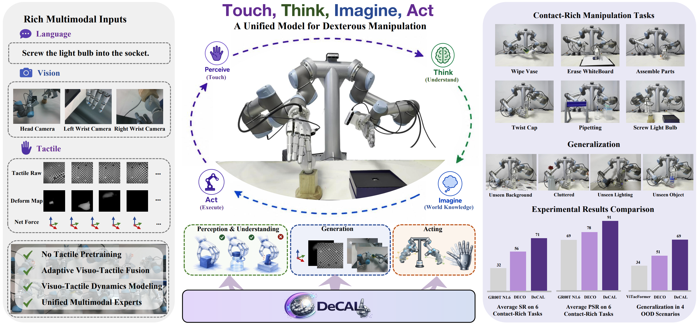

<div align="center">


# DeCAL: Towards Physically-Grounded Dexterous Vision-Language-Action Models via Contact-Aware Latent Co-Imagination

</div>

[](https://github.com/AureleoPKU/DeCAL)
[](https://github.com/AureleoPKU/DeCAL)
[](https://github.com/AureleoPKU/DeCAL)

## 🔥 Highlights
**DeCAL** is a physically grounded dexterous VLA model that unifies multimodal understanding, visuo-tactile imagination, and action generation within a collaborative framework. Equipped with rich multimodal inputs, DeCAL achieves strong performance across diverse contact-rich dexterous manipulation tasks and demonstrates robust generalization to unseen scenarios.

- 🧠 *Unified Experts: A Mixture-of-Transformers architecture unifies understanding, visuo-tactile imagination, and coordinated arm-hand action generation.*
- ✋ *Contact-Aware Touch: Adaptive gating selectively integrates tactile cues, while latent co-imagination models future interaction dynamics.*
- 🏆 *Strong Results: DeCAL achieves 71% SR and 83.4% PSR across six real-world tasks, with robust generalization to four OOD settings.*

<p align="center">
  
</p>

## 📑 Table of Contents
- [Installation](#section-Installation)
- [Policy Training](#section-PolicyTraining)
- [Evaluation & Inference](#section-Evaluation)

<span id="section-Installation"></span>
## 🛠️ Installation

This repository has been tested on **Python 3.10** and **CUDA 12.8**.
We recommend using **conda** to create an isolated environment.

### 1. Create Conda Environment

```bash
conda create -y -n decal python=3.10
conda activate decal

pip install --upgrade pip
```

### 2. Install System Dependencies

We use FFmpeg for video encoding/decoding and SVT-AV1 for efficient storage.

```bash
conda install -c conda-forge ffmpeg=7.1.1 svt-av1 -y
```

### 3. Install PyTorch (CUDA 12.8)

```bash
pip install torch==2.7.1 torchvision==0.22.1 torchaudio==2.7.1 \
  --index-url https://download.pytorch.org/whl/cu128
```

### 4. Install Python Dependencies

```bash
pip install -e .
```

### 5. Download the Pretrained Checkpoint

Download the pretrained [InternVLA-A1-3B](https://huggingface.co/InternRobotics/InternVLA-A1-3B)
checkpoint used to initialize DeCAL:

```bash
hf download InternRobotics/InternVLA-A1-3B \
  --revision 19e953fb2d4b49d2b181c0b55981f2bd3444d546 \
  --cache-dir ckpt/pretrained_ckpts
```

The launch scripts resolve the downloaded snapshot from `ckpt/pretrained_ckpts`.
Qwen3-VL and Cosmos Tokenizer weights are downloaded automatically when first used.

### 6. Patch HuggingFace Transformers

We replace the default implementations of several model modules (e.g., **DeCAL**, **π0**) to support custom architectures for robot learning.

```bash
TRANSFORMERS_DIR=${CONDA_PREFIX}/lib/python3.10/site-packages/transformers/

cp -r src/lerobot/policies/pi0/transformers_replace/models        ${TRANSFORMERS_DIR}
cp -r src/lerobot/policies/DeCAL/transformers_replace/models  ${TRANSFORMERS_DIR}
```

Make sure the target directory exists—otherwise create it manually.

### 7. Configure Environment Variables

```bash
export HF_TOKEN=your_token  # for downloading hf models, tokenizers, or processors
export HF_HOME=path_to_huggingface   # default: ~/.cache/huggingface
export HF_LEROBOT_HOME=/path/to/lerobot/datasets  # default: $HF_HOME/lerobot
export WANDB_API_KEY=your_wandb_api_key  # required by the training launch scripts
```

---
<span id="section-PolicyTraining"></span>
## 🎯 Policy Training

This section shows the DeCAL workflow: convert raw robot data to LeRobot v3.0,
compute normalization statistics, and fine-tune the tactile policy.

---

### 1. Convert raw JSON data to LeRobot v3.0

We provide a script to convert raw JSON data collected in Unitree's official format
([avp_teleoperate/tree/g1](https://github.com/unitreerobotics/avp_teleoperate/tree/g1))
to LeRobot v3.0.

The current converter implements only the `Ur5_Sharpa` feature schema. Other
robot types require explicit state, action, tactile, camera, and image mappings;
unsupported values fail immediately with `NotImplementedError`.

```bash
python src/lerobot/datasets/v30/convert_unitree_json_to_lerobot_v30.py \
  --raw_dir "${RAW_DATA_DIR}" \
  --repo_id "${DATASET_REPO_ID}" \
  --robot_type Ur5_Sharpa \
  --custom_task_description "${LANGUAGE_INSTRUCTION}"
```

The converter stores the dataset under:

```text
${HF_LEROBOT_HOME}/{DATASET_REPO_ID}
```

### 2. Compute normalization statistics

```bash
python util_scripts/compute_norm_stats_single.py \
  --action_mode abs \
  --chunk_size 50 \
  --repo_id "${DATASET_REPO_ID}"
```

This writes `stats.json` under
`${HF_LEROBOT_HOME}/stats/abs/${DATASET_REPO_ID}/`.

### 3. Fine-tune DeCAL
```bash
bash launch/decal_finetune.sh "${DATASET_REPO_ID}" abs true
```

#### ⚠️ Important Note

Before running `launch/decal_finetune.sh`, configure the relevant environment variables:

* CUDA / GPU-related environment variables
* Paths to your local dataset and output directories

<span id="section-Evaluation"></span>
## 🤖 Evaluation & Inference

### 1. Offline Evaluation
```bash
python tests/policies/decal/deploy_policy_tactile.py \
  --checkpoint /path/to/checkpoint
```

### 2. Inference on Server
```bash
python tests/policies/decal/deploy_policy_tac_server.py \
  --checkpoint /path/to/checkpoint
```


## Citation
If you find our work useful, please consider citing us and give a star to our repository! 🌟🌟🌟

```BibTeX
@article{fu2026decal,
  title={DeCAL: Towards Physically-Grounded Dexterous Vision-Language-Action Models via Contact-Aware Latent Co-Imagination},
  author={Yankai Fu, Ning Chen, Junkai Zhao, Heng Zhang, Pengwei Wang, Zhongyuan Wang, Shanghang Zhang},
  journal={arXiv preprint},
  year={2026}
}
```

## ❤️ Acknowledgments

- [Lerobot](https://github.com/huggingface/lerobot)
- [openpi](https://github.com/Physical-Intelligence/openpi)
- [InternVLA-A1](https://github.com/InternRobotics/InternVLA-A-series/tree/InternVLA-A1)
- [COSMOS](https://github.com/nvidia-cosmos)
